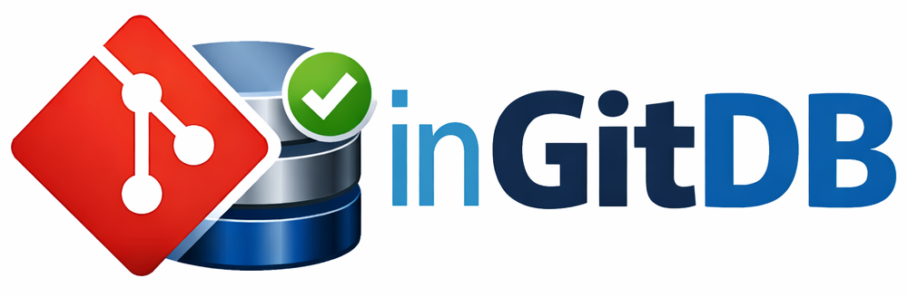

# inGitDB 

Open source versioned db for colloboration that stores data in text files (_json, yaml, columnar storage_). 

Probably the best solution for change-managing reference data.

## Demo Databases
- [**demo-ingitdb**](https://github.com/ingitdb/dalgo2ingitdb) - the canonical example inGitDB (_Geo data, ToDo_).

_If you know a good public inGitDB please submit a PR with a link._

## Relevant repositories
- [**ingitdb-action**](https://github.com/ingitdb/ingitdb-action) - GitHub Action for inGitDB schema & data validation
- [**ingitdb-go**](https://github.com/ingitdb/ingitdb-go) - Go code for inGitDB schema definition & validation
- [**dalgo2ingitdb**](https://github.com/ingitdb/dalgo2ingitdb) - a [DALgo](https://github.com/dal-go/dalgo) API adapter for accessing inGitDB from Go programs.
- [**ingitdb-ts**](https://github.com/ingitdb/ingitdb-ts) - a TypeScript/Javascritp client for web and NodeJS apps.
